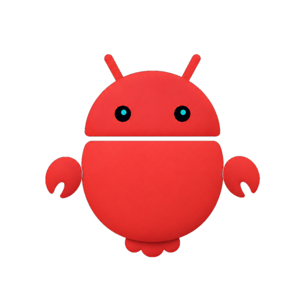
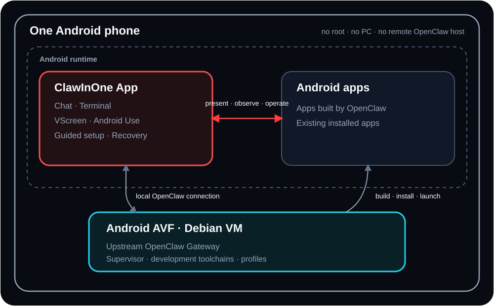

<p align="center">
  
</p>

<h1 align="center">ClawInOne</h1>

<p align="center"><strong>OpenClaw on Android, all in one.</strong></p>

<p align="center">
  <a href="README.md">English</a> · <a href="README.zh-CN.md">简体中文</a>
</p>

ClawInOne makes one Android phone both the computer running OpenClaw and the
Android device it builds for and operates.

It runs a pinned upstream OpenClaw Gateway inside Android's official AVF Debian
environment, then connects it back to the same phone for development, app
delivery, interactive presentation, and permission-scoped device use.

**No root. No PC. No separate server deployment.**

## Demos

### Build and run a Godot game—entirely on the phone

<!-- GODOT_DEMO_VIDEO -->

OpenClaw creates a Godot project, builds its ARM64 APK, installs it, previews it
in VScreen, and launches the real app—all on the same Android phone.

### Use Android apps on the same phone

<!-- ANDROID_USE_DEMO_VIDEO -->

OpenClaw uses Calculator to compute `379 x 4`, carries `1516` into Calendar,
creates **ClawInOne demo - 1516** for next Monday at 2:00 PM, and verifies the
saved event. The highlight is cut from one continuous 4-minute 42-second run on
the same physical phone—no desktop or remote Android device is involved.

> **Alpha release:** pinned to [OpenClaw 2026.9.4](UPSTREAM.md) and verified on
> Pixel 8 / Android 17. Clean-device onboarding and broader device coverage
> remain open validation work.

## One phone, one complete loop

```text
Prompt -> Code -> Build -> Install -> Run -> Observe -> Interact -> Improve
```



Every component above runs on the same physical Android phone. Upstream
OpenClaw remains the only Agent runtime; ClawInOne supplies the managed local
environment and bounded bridge into Android.

## What works

`Verified` below means observed on the retained Pixel 8 baseline documented in
[Validation](docs/validation.md), not universal device support.

| Capability | Status | What it enables |
| --- | --- | --- |
| Managed local OpenClaw | Verified | Installs, verifies, starts, and recovers a pinned upstream Gateway in AVF Debian. |
| Android development | Verified | Kotlin, NDK, Flutter, Godot, and React Native builds on the phone. |
| Web development | Verified | React/TypeScript/Vite build, serve, exact reverse, and open/update in Android Chrome. |
| App Delivery | Verified | Receipt-bound APK inspection, installation, launch, readback, screenshots, and bounded logs. |
| VScreen | Verified | A built-in interactive virtual Android display powered by a pinned scrcpy server. |
| Terminal | Verified | Shell access to the same Debian environment used by OpenClaw. |
| Android Use | Verified, opt-in | Explicitly authorized observation and operation of an exact Android app. |

Android Chrome CDP automation is not part of the current release. Opening a Web
result in real Android Chrome is verified; browser automation remains deferred.

## Managed setup on the phone

ClawInOne checks device capabilities, guides the Android-owned Linux and
Developer options steps, connects its signed Supervisor, and installs the pinned
OpenClaw environment. Users do not manually provision Node, OpenClaw, Gateway
services, ADB, Chromium, or scrcpy on a PC or server.

System-owned consent still stays explicit: the official Linux environment,
Wireless debugging, AI access, and optional Android Use Accessibility setup may
require user action. AI providers and dependency downloads may require network
access; ClawInOne does not claim fully offline or silent setup.

## Device compatibility

ClawInOne is capability-gated, not model-allowlisted. It currently requires:

- Android API 35 or later and ARM64 (`arm64-v8a`);
- Android Virtualization Framework and the official system Linux Terminal;
- a launchable official Debian environment;
- Developer options and Wireless debugging;
- sufficient storage and memory for the selected development profiles.

| Device | Android | Coverage |
| --- | --- | --- |
| Pixel 8 (`shiba`) | Android 17 / API 37 | Full retained-device baseline |

Tensor-based Pixel devices that pass every runtime probe—including the Pixel 6
family on Android 16 or later—are expected compatibility candidates, not yet
verified support claims. See [Device compatibility](docs/device-compatibility.md).

## Quick start

### Install

Download the signed APK and `SHA256SUMS` from
[GitHub Releases](https://github.com/boxuechen/claw-in-one/releases). Device
requirements and the guided on-phone setup are documented in
[Installation](docs/installation.md).

### Build from source

```bash
git clone https://github.com/boxuechen/claw-in-one.git
cd claw-in-one/apps/android
./gradlew :app:assembleThirdPartyDebug
```

The debug APK is written to
`apps/android/app/build/outputs/apk/thirdParty/debug/`. See
[Building from source](docs/building.md) for prerequisites, installation, and
repository verification.

## Technical documentation

- [Documentation index](docs/README.md)
- [Installation](docs/installation.md) and [Building from source](docs/building.md)
- [Architecture](docs/architecture.md)
- [Development environment](docs/development-environment.md)
- [Development profiles](docs/development-profiles.md)
- [Device Bridge](docs/device-bridge.md) and [App Delivery](docs/app-delivery.md)
- [VScreen](docs/vscreen.md), [Android Use](docs/android-use.md), and [Terminal](docs/terminal.md)
- [Validation](docs/validation.md) and [Roadmap](docs/roadmap.md)
- [Changelog](CHANGELOG.md)
- [Maintainer contracts](docs/maintainers/README.md)

## Relationship to OpenClaw

ClawInOne keeps upstream OpenClaw as its only Agent runtime. Its Android App is
derived from the upstream OpenClaw Android App; ClawInOne adds the same-device
runtime, setup, development, delivery, presentation, and device-operation
environment around it.

ClawInOne is an independent community project, not an official OpenClaw
distribution. See [UPSTREAM.md](UPSTREAM.md) for exact provenance.

Contributions are welcome under [CONTRIBUTING.md](CONTRIBUTING.md). Report
vulnerabilities privately through [SECURITY.md](SECURITY.md).

Licensed under the [MIT License](LICENSE), with upstream and dependency
attribution in [THIRD_PARTY_NOTICES.md](THIRD_PARTY_NOTICES.md).
